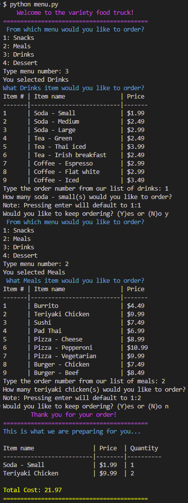

# python-challenge-1   

## Description
This is a small Python application created to help you place food orders. It prompts you to choose the items you want to add to your order from a menu, then generates a receipt and calculates the total amount due at the bottom.

## Table of Contents

- [Usage](#usage)
- [Credits](#credits)
- [License](#license)
- [Screenshot](#screenshot)

## Usage
>**To use the application...**
1. run `python menu.py` from the root directory. 
2. The program will prompt you to choose from a menu. Select the appropriate Item #.
3. The program will prompt you to choose the item you would like to order from the menu you chose in step 2. Select the appropriate Item #.
4. You will then be asked if you would like to keep ordering. If you type `y` it will repeat from step 2. If you type `n` it will complete your order. 
5. Finally, after completing your order, it will then print out your receipt and calculate your total. 

## Credits
Starter code for this assignment was provided by [edX bootcamp](https://www.edx.org/boot-camps).

## License
  
 **The MIT License:** 

## Screenshots
>**Program Preview...**

  
 

